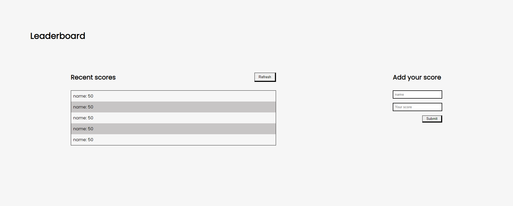

# Leaderboard
The leaderboard website displays scores submitted by different players. It also allows you to submit your score. All data is preserved thanks to the external Leaderboard API service.

## Built With

- HTML & CSS
- JAVASCRIPT
- WebPack 5

## Live Demo

[Live Demo Link](https://abdollahraafat.github.io/Leaderboard/)

## Get a copy

- Prepare a local directory. 
- Open terminal.
- Clone this project by the command `git clone https://github.com/AbdollahRaafat/Leaderboard.git`.

## Author

- GitHub: [AbdollahRaafat](https://github.com/AbdollahRaafat)
- LinkedIn: [AbdollahRaafat](https://www.linkedin.com/in/abdollah-raafat-886059221/)

## Acknowledgments

- Microverse

## 📝 License

This project is [MIT](./MIT.md) licensed.
